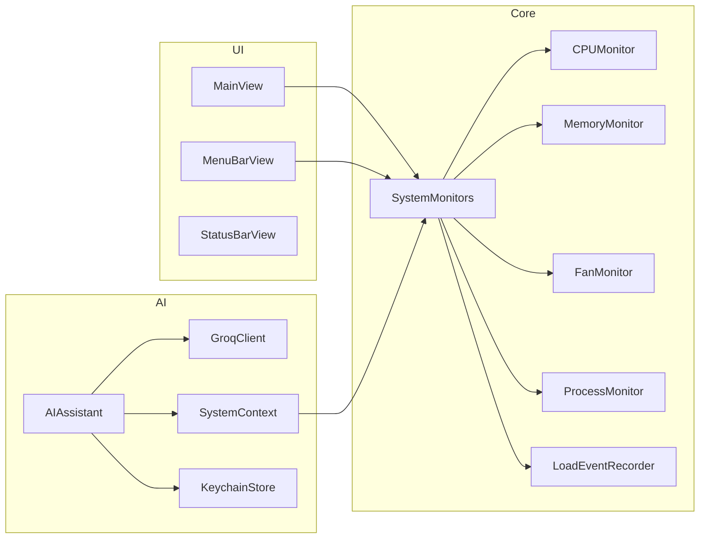

<div align="center">

# MacMonitor

**macOS için yerel sistem monitörü — gerçek zamanlı metrikler ve Groq destekli AI asistan.**

İşlemci, bellek, fan/sıcaklık, çalışan işlemler ve genel sistem durumunu canlı izler.  
Menü çubuğundan hızlı bakış; tam pencerede detaylı analiz.

<br>

[](https://www.apple.com/macos/)
[](https://swift.org/)
[](https://developer.apple.com/xcode/swiftui/)

[İndir (DMG)](#hızlı-kurulum) · [Kaynaktan derle](#kaynaktan-derleme) · [AI Asistan](#ai-asistan) · [Sorun bildir](https://github.com/vidinsight-labs/MacMonitor/issues)

</div>

---

## İçindekiler

- [Neden MacMonitor?](#neden-macmonitor)
- [Özellikler](#özellikler)
- [Hızlı kurulum](#hızlı-kurulum)
- [Kaynaktan derleme](#kaynaktan-derleme)
- [DMG üretme](#dmg-üretme)
- [AI Asistan](#ai-asistan)
- [Mimari](#mimari)
- [Proje yapısı](#proje-yapısı)
- [Platform notları](#platform-notları)
- [Bilinen sınırlar](#bilinen-sınırlar)
- [Lisans](#lisans)

---

## Neden MacMonitor?

| | MacMonitor | Activity Monitor |
|---|---|---|
| **Menü çubuğu widget'ı** | CPU/RAM + en çok kullanan 3 işlem | Yok |
| **Geçmiş grafikleri** | 60 sn CPU geçmişi (Swift Charts) | Anlık görünüm |
| **Yük olayları** | Eşik aşımında kayıt + sorumlu işlemler (1 ay) | Yok |
| **AI teşhis** | Groq ile gerçek sistem verisine dayalı analiz | Yok |
| **Fan / SMC** | Intel Mac'lerde tam okuma | Sınırlı |
| **Türkçe arayüz** | Tamamen yerelleştirilmiş | Kısmen |

MacMonitor, Activity Monitor'ün yerini almak için değil — **günlük kullanımda hızlı fark edilen sorunları** (yüksek CPU, bellek baskısı, termal kısılma) tek yerden takip etmek için tasarlandı.

---

## Özellikler

### Asistan
Groq API anahtarınla çalışan AI asistan; soru sorulduğunda **gerçek CPU, bellek ve işlem verisini** bağlam olarak kullanır. "Sistemimi Analiz Et" ile otomatik teşhis veya serbest soru.

### İşlemci
- Çekirdek başına kullanım (Performans / Verimlilik ayrımı)
- Toplam yük ve 60 saniyelik geçmiş grafiği
- CPU modeli ve Mac donanım bilgisi
- **Yük olayları:** CPU eşiği aştığında anı + sorumlu işlemleri kaydeder (son 1 ay, diske kalıcı)

### Bellek
- Aktif / sabitlenmiş / sıkıştırılmış / boş dağılımı
- Bellek basıncı, takas (swap) kullanımı
- Açık kalma süresi ve yeniden başlatma önerisi
- **Belleği Temizle** (`purge`) tek tıkla

### Fanlar & Sıcaklık
- Fan RPM ve SMC sıcaklık sensörleri
- Termal durum göstergesi
- Fan kontrol arayüzü *(Intel Mac'lerde)*

### İşlemler
- CPU ve belleğe göre sıralanabilir tablo
- Anlık arama ve uygulama ikonları
- **Zorla Kapat** (onaylı diyalog)

### Sistem
- Termal kısılma (throttling) durumu
- Düşük Güç Modu, pil/güç bilgisi
- Disk alanı ve kullanım oranı
- Donanım bileşenleri: model, seri no, çip, Wi-Fi / Bluetooth / SSD

### Menü çubuğu
Pencere kapalıyken bile çalışır. Popover'da CPU/RAM çubukları, en çok kaynak tüketen 3 işlem ve **Aç** düğmesi.

> Tüm sayfalar koyu/açık moda uyumlu ortak bir tasarım dili paylaşır.

---

## Hızlı kurulum

### 1. DMG indir

[Releases](https://github.com/vidinsight-labs/MacMonitor/releases) sayfasından `MacMonitor-x.y.dmg` dosyasını indir.

### 2. Uygulamayı kur

1. DMG dosyasına çift tıkla
2. **MacMonitor**'u **Applications** klasörüne sürükle
3. DMG'yi çıkar

### 3. İlk açılış

macOS Gatekeeper uyarısı çıkarsa:

```
Sağ tık → Aç → Aç
```

> Uygulama ad-hoc imzalıdır. Geniş dağıtım için Apple Developer ID imzası + notarization gerekir.

---

## Kaynaktan derleme

Xcode projesi `project.yml` dosyasından **XcodeGen** ile üretilir (`.xcodeproj` depoda tutulmaz).

**Gereksinimler:** macOS 13+, Xcode 15+ (tam Xcode — Command Line Tools yeterli değil)

```bash
git clone https://github.com/vidinsight-labs/MacMonitor.git
cd MacMonitor

brew install xcodegen    # bir kez
xcodegen generate        # MacMonitor.xcodeproj üretir
open MacMonitor.xcodeproj
```

Xcode'da **Cmd+R** ile derle ve çalıştır.

---

## DMG üretme

```bash
./scripts/build-dmg.sh        # MacMonitor-1.0.dmg
./scripts/build-dmg.sh 1.2    # sürüm belirterek
```

Betik Release derlemesi yapar, `MacMonitor.app` + Applications kısayolunu paketler ve sıkıştırılmış `.dmg` çıkarır.

---

## AI Asistan

### Kurulum

1. [console.groq.com](https://console.groq.com) adresinden **ücretsiz API anahtarı** al
2. Uygulamada **Asistan** sekmesine git → anahtarı yapıştır → **Kaydet**
3. **Bağlan** → önerilen model otomatik seçilir (örn. `llama-3.3-70b-versatile`)
4. **Sistemimi Analiz Et** veya serbest soru sor

### Gizlilik

| | |
|---|---|
| **Anahtar saklama** | Yalnızca macOS Keychain — diske düz metin yazılmaz |
| **Veri paylaşımı** | Opt-in: soru sorulduğunda işlem/sistem verisi Groq'a gönderilir |
| **Model kalitesi** | Büyük modeller (70B) Türkçe teşhiste belirgin daha iyi |

---

## Mimari



**MVVM** mimarisi. Her monitör bir `ObservableObject`; tek bir `SystemMonitors` konteynerinde paylaşılır — hem ana pencere hem menü çubuğu aynı örnekleri kullanır (çift veri toplama yok). Veriler 2–5 saniyede bir `Timer` ile güncellenir.

**Veri kaynakları:** `sysctl` · `mach` · `IOKit` (SMC) · `libproc`

---

## Proje yapısı

```
macbook-monitor/
├── MacMonitor/
│   ├── App/              # Giriş noktası, AppDelegate (menü bar), SystemMonitors
│   ├── Models/           # CPUData, MemoryData, FanData, ProcessData, LoadEvent
│   ├── Monitors/         # sysctl / mach / IOKit / libproc veri toplama
│   ├── Services/AI/      # KeychainStore, GroqClient, AIAssistant, SystemContext
│   ├── Views/            # SwiftUI ekranları + DesignSystem
│   └── Resources/        # Entitlements
├── scripts/
│   └── build-dmg.sh      # Release derle + .dmg üret
├── project.yml           # XcodeGen proje tanımı (kaynak)
└── README.md
```

---

## Platform notları

| Özellik | Intel Mac | Apple Silicon |
|---|:---:|:---:|
| CPU kullanımı | ✅ | ✅ |
| Bellek / swap | ✅ | ✅ |
| İşlem listesi | ✅ | ✅ |
| Termal kısılma | ✅ | ✅ |
| Pil / güç | ✅ | ✅ |
| Fan RPM / SMC sıcaklık | ✅ | ❌ |
| CPU frekansı (SMC) | ✅ | ❌ |

Apple Silicon'da SMC anahtarları Intel'e özgü olduğu için fan/sıcaklık metrikleri "okunamadı" gösterir. Termal kısılma, pil ve disk bilgileri `ProcessInfo` / IOKit ile normal çalışır.

---

## Bilinen sınırlar

- **Sandbox kapalıdır** — SMC erişimi, `purge` ve ağ için gerekli. App Store dağıtımına uygun değildir.
- **Zorla Kapat** yalnızca kendi kullanıcı süreçlerinde çalışır; sistem süreçleri root yetkisi gerektirir.
- **AI kalitesi** seçilen Groq modeline bağlıdır; büyük modeller Türkçe'de belirgin daha iyi sonuç verir.
- **Ad-hoc imza** — ilk açılışta Gatekeeper uyarısı normaldir (Sağ tık → Aç).

---

## Lisans

Henüz resmi bir lisans dosyası eklenmemiştir. Kullanım koşullarını belirlemek için depoya bir `LICENSE` dosyası (örn. MIT) eklenebilir.

---

<div align="center">

**[⬆ Başa dön](#macmonitor)**

Made with Swift & SwiftUI · [vidinsight-labs/MacMonitor](https://github.com/vidinsight-labs/MacMonitor)

</div>
