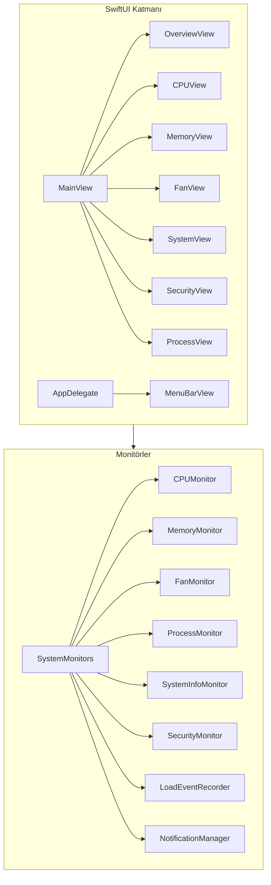
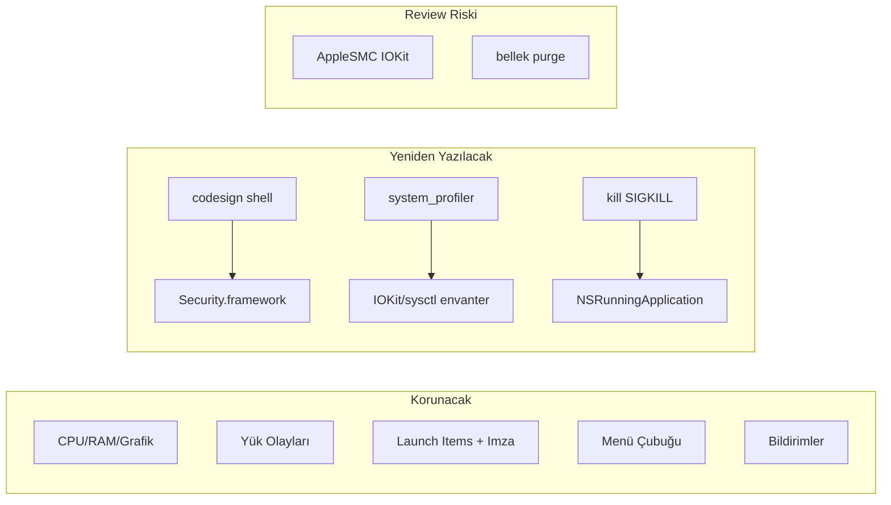
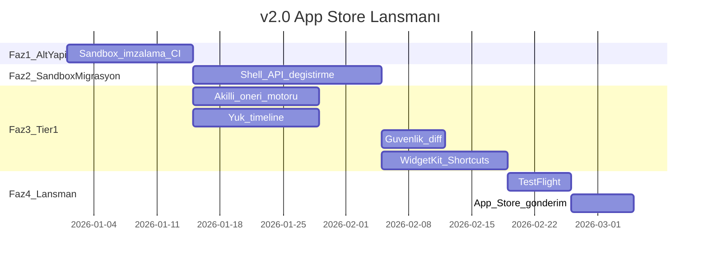

# MacMonitor: Repo İncelemesi ve App Store Yol Haritası

> **Canlı plan belgesi** — App Store v2.0 lansmanına kadar geliştirme bu dokümana göre ilerler.  
> Son güncelleme: 2025-06-25  
> **Eklenen özelliklerin özeti:** [YENI_OZELLIKLER.md](YENI_OZELLIKLER.md)

## Görev Listesi

### Faz 1 — Altyapı
- [x] Sandbox + hardened runtime etkinleştir; `project.yml` ve entitlements güncelle
- [x] GitHub Actions ile xcodegen + xcodebuild CI pipeline kur

### Faz 2 — Sandbox migrasyonu
- [x] `codesign` / `system_profiler` / `purge` / `kill` shell çağrılarını Security.framework ve native API ile değiştir
- [x] Kullanılamayan özellikler için Capability protokolü ve net UI fallback mesajları

### Faz 3 — Tier 1 (App Store öncesi zorunlu)
- [x] Yerel kural tabanlı akıllı öneri motoru — OverviewView + MenuBarView
- [x] LoadEventRecorder verisi için Swift Charts zaman çizelgesi
- [x] Güvenlik diff — ilk tarama baseline, sonraki taramalarda yeni/kaldırılan launch item vurgusu
- [x] WidgetKit widget (sağlık skoru + CPU/RAM) ve App Intents/Shortcuts

### Faz 4 — Lansman
- [x] PrivacyInfo.xcprivacy, gizlilik politikası URL, App Store metadata
- [x] TestFlight beta — sandbox + Tier 1 özelliklerinin birlikte doğrulanması (kontrol listesi)
- [x] Tier 1 ekran görüntüleri dahil review notları ve ilk App Store gönderimi (dokümantasyon)

---

## Mevcut Durum Özeti

MacMonitor, **SwiftUI + AppKit** ile yazılmış, harici bağımlılığı olmayan, **TR/EN** destekli bir macOS sistem monitörüdür. Mimari temiz: singleton [`SystemMonitors`](../MacMonitor/App/SystemMonitors.swift) tüm monitörleri paylaşır; UI [`MainView`](../MacMonitor/Views/MainView.swift) üzerinden 8 sekmeye ayrılır.

### Güçlü Yanlar (App Store'da fark yaratacak)

| Alan | Neden önemli |
|------|----------------|
| **Düz dil sağlık yargısı** | [`OverviewView`](../MacMonitor/Views/OverviewView.swift) — Activity Monitor'dan daha erişilebilir |
| **Yük olayı kaydı** | [`LoadEventRecorder`](../MacMonitor/Monitors/LoadEventRecorder.swift) — "Geçen hafta ne yavaşlattı?" sorusuna yanıt; rakiplerde nadir |
| **Güvenlik şeffaflığı** | [`SecurityMonitor`](../MacMonitor/Monitors/SecurityMonitor.swift) — antivirüs değil, açılış öğeleri + imza durumu |
| **Proaktif bildirimler** | [`NotificationManager`](../MacMonitor/Monitors/NotificationManager.swift) — spam korumalı, süreklilik tabanlı |
| **Menü çubuğu widget** | [`MenuBarView`](../MacMonitor/Views/MenuBarView.swift) + [`AppDelegate`](../MacMonitor/App/AppDelegate.swift) |
| **Performans disiplini** | Paylaşılan singleton, ağır taramalar butonla, ayrı saat alt görünümü |
| **Yerelleştirme** | Türk pazarı için doğal avantaj |

### Kritik App Store Engelleri

Şu anki yapılandırma App Store'a **uygun değil**:

- [`MacMonitor.entitlements`](../MacMonitor/Resources/MacMonitor.entitlements): `com.apple.security.app-sandbox` = **false** (IOKit/SMC için bilinçli tercih)
- [`project.yml`](../project.yml): ad-hoc imza (`CODE_SIGN_IDENTITY: "-"`), hardened runtime kapalı, notarization/App Store pipeline yok

---

## App Store "Tam Özellik" Gerçekçi Değerlendirme

Hedef: **MAS'ta mümkün olan en tam sürüm + ücretsiz**. Apple sandbox zorunluluğu bazı özellikleri doğrudan engeller; bazılarını **alternatif API** ile kurtarabilirsiniz.

### Özellik bazlı uyumluluk matrisi

| Özellik | Mevcut API | Sandbox sonrası | Önerilen yaklaşım |
|---------|-----------|-----------------|-------------------|
| CPU / bellek / uptime | `host_*`, `sysctl` | **Çalışır** | Değişiklik yok |
| P/E çekirdek ayrımı | `sysctl` | **Çalışır** | Değişiklik yok |
| İşlem listesi | `proc_*` | **Büyük ölçüde çalışır** | Test et; gerekirse `NSRunningApplication` ile tamamla |
| Zorla kapatma | `kill(SIGKILL)` | **Kısıtlı** | `NSRunningApplication.terminate()` — yalnızca kullanıcı uygulamaları |
| Fan / SMC sıcaklık | IOKit `AppleSMC` | **Muhtemelen çalışmaz** | App Review notunda geçici IOKit istisnası dene |
| Termal durum | `ProcessInfo.thermalState` | **Çalışır** | Apple Silicon'da birincil sıcaklık kaynağı |
| Pil / disk | IOKit.ps, `URL.resourceValues` | **Çalışır** | Değişiklik yok |
| Donanım envanteri | `system_profiler` shell | **Çalışmaz** | IOKit registry + `sysctl` ile hafif envanter |
| Güvenlik imza kontrolü | `codesign` shell | **Çalışmaz** | `Security.framework` — sandbox içinde mümkün |
| LaunchAgents taraması | dosya okuma | **Büyük ölçüde çalışır** | `~/Library`, `/Library` okuma genelde mümkün |
| Bellek purge | `osascript` + `purge` | **Çalışmaz** | Kaldır veya "Yeniden başlatmayı düşünün" önerisi |
| Disk tarama (`du`) | shell | **Kısıtlı** | Kullanıcıdan klasör seçimi veya sadeleştir |
| Yük olayları JSON | Application Support | **Çalışır** | Container path'e taşı |
| Bildirimler | UserNotifications | **Çalışır** | Değişiklik yok |

**Sonuç:** Tam özellik hedefi gerçekçi olan **~85%** özellik setidir.

---

## İnovatif Özellik Önerileri

### Tier 1 — App Store v2.0 lansman kapsamı (sandbox ile birlikte)

> **Tier 1, App Store gönderiminden önce tamamlanır.**

1. **Akıllı Öneri Motoru (yerel, kural tabanlı)** — OverviewView + MenuBarView
2. **Yük Olayı Zaman Çizelgesi** — LoadEventRecorder + Swift Charts
3. **Güvenlik Diff / İlk Tarama** — baseline karşılaştırma
4. **WidgetKit (macOS)** — sağlık skoru, CPU/RAM mini göstergesi
5. **Shortcuts / App Intents** — sağlık kontrolü, güvenlik taraması, top işlemler

### Tier 2 — App Store sonrası

6. BYOK AI Asistan (Groq/OpenAI, kullanıcı anahtarı)
7. Sağlık Raporu Dışa Aktarma (PDF/JSON)
8. Menü Çubuğu Özelleştirme
9. Ağ İzleme (`getifaddrs` / Network framework)

### Tier 3 — Uzun vadeli

10. Apple On-Device Intelligence (macOS 26+ Foundation Models)
11. iCloud senkron yük olayları
12. Notarization durumu + gelişmiş imza analizi

---

## App Store Hazırlık Yol Haritası

> Faz 2 ve Faz 3 **paralel** ilerler: sandbox migrasyonu monitör katmanında, Tier 1 özellikleri UI/servis katmanında.

### Faz 1 — Altyapı ve imzalama (1–2 hafta)

- [`project.yml`](../project.yml): sandbox **true**, hardened runtime **true**, automatic signing
- `PrivacyInfo.xcprivacy` ekle
- CI: GitHub Actions (xcodegen + xcodebuild)
- Widget extension target ekle (XcodeGen'de ikinci target)

### Faz 2 — Sandbox uyum migrasyonu (2–3 hafta, Faz 3 ile paralel)

| Dosya | Değişiklik |
|-------|-----------|
| `SecurityMonitor.swift` | `codesign` shell → Security.framework |
| `SystemInfoMonitor.swift` | shell komutları → native API |
| `MemoryMonitor.swift` | `purge` kaldır veya devre dışı |
| `ProcessMonitor.swift` | `kill` → `NSRunningApplication.terminate()` |
| `FanMonitor.swift` | IOKit istisnası dene; fallback termal API |
| `LoadEventRecorder.swift` | App container path |
| Tüm monitörler | Capability protokolü + UI fallback |

### Faz 3 — Tier 1 inovasyon (Faz 2 ile paralel, zorunlu)

| Özellik | Dosya / yaklaşım |
|---------|------------------|
| Akıllı öneri motoru | Yeni `SmartInsightsEngine.swift` + OverviewView + MenuBarView |
| Yük olayı timeline | CPUView veya yeni `LoadHistoryView` |
| Güvenlik diff | SecurityMonitor + SecurityView (baseline JSON) |
| WidgetKit | Yeni `MacMonitorWidget` extension (App Group) |
| Shortcuts | Yeni `AppIntents/` klasörü |

**Tier 1 tamamlanmadan App Store gönderimi yapılmaz.**

### Faz 4 — TestFlight + App Store lansmanı (1–2 hafta)

- Privacy Policy + Support URL
- 6+ ekran görüntüsü (Tier 1 özellikleri dahil)
- TestFlight: sandbox + Tier 1 birlikte test
- App Review Notes + **v2.0** gönderim

### Faz 5 — Tier 2+ (App Store sonrası)

- AI asistan, dışa aktarma, menü çubuğu özelleştirme, ağ izleme

---

## Rekabet Konumlandırması

| Rakip | Dağıtım | MacMonitor farkı |
|-------|---------|------------------|
| Activity Monitor | Sistem | Düz dil, menü çubuğu, yük geçmişi, güvenlik bakışı |
| iStat Menus | Doğrudan (MAS değil) | Ücretsiz + açık kaynak + TR dil |
| CleanMyMac | MAS + doğrudan | Temizlik değil, izleme + şeffaflık |
| Stats | Doğrudan | Daha erişilebilir UX hedefi |

---

## Riskler ve Mitigasyon

| Risk | Olasılık | Mitigasyon |
|------|----------|------------|
| AppleSMC entitlement reddi | Yüksek | Termal API + "Intel'de sınırlı" mesajı |
| Process kill reddi | Orta | Yalnızca terminate(); review notunda açıkla |
| Review süresi / iterasyon | Orta | TestFlight ile erken doğrula |
| Apple Silicon fan verisi yok | Kesin | UI'da net açıklama |
| Test/CI eksikliği | Orta | Build CI + kritik unit testler |

---

## Önerilen Uygulama Sırası

1. **Faz 1** — Sandbox + hardened runtime + CI + widget extension iskeleti
2. **Faz 2 + Faz 3 paralel** — sandbox migrasyonu + Tier 1 özellikleri
3. **Faz 4** — TestFlight → App Store metadata → **v2.0 gönderim**
4. **Faz 5** — Tier 2+
