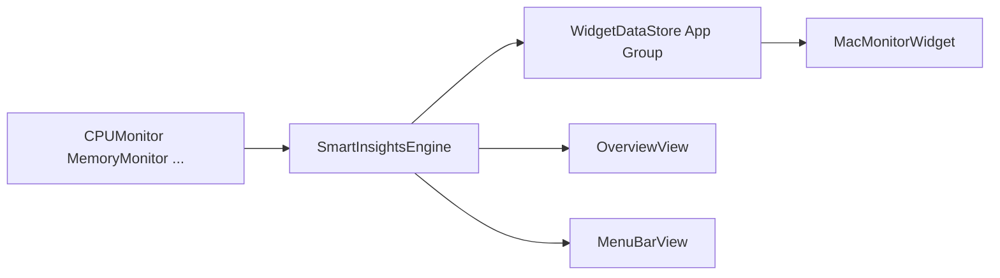

# MacMonitor v2.0 — Eklenen Özellikler

> App Store hazırlığı kapsamında projeye eklenen kullanıcı özellikleri, teknik altyapı ve davranış değişiklikleri.  
> Son güncelleme: 25 Haziran 2025

İlgili belgeler: [App Store planı](APP_STORE_PLAN.md) · [Gönderim rehberi](APP_STORE_SUBMIT.md) · [TestFlight kontrol listesi](TESTFLIGHT_CHECKLIST.md)

---

## Özet

v2.0 ile MacMonitor yalnızca “teknik sandbox geçişi” değil; mağazada fark yaratacak **5 Tier 1 özelliği** ve App Store uyumlu altyapıyı birlikte kazandı. Tüm yeni kullanıcı özellikleri **yerel çalışır** — bulut/API yok, veri cihazda kalır.

| Kategori | Ne eklendi |
|----------|------------|
| Kullanıcı özellikleri | Akıllı öneriler, yük zaman çizelgesi, güvenlik diff, Widget, Shortcuts |
| Altyapı | Sandbox, hardened runtime, Widget extension, App Group, CI |
| Uyumluluk | Security.framework imza, native API migrasyonu, özellik fallback’leri |
| Dokümantasyon | Gizlilik, metadata, review notları, TestFlight listesi |

---

## 1. Akıllı Öneri Motoru

**Dosya:** [`MacMonitor/Services/SmartInsightsEngine.swift`](../MacMonitor/Services/SmartInsightsEngine.swift)

Mevcut monitör verisinden **kural tabanlı**, düz dilde öneriler üretir. Ek timer yok; CPU, bellek, işlem, disk ve yük olaylarına abone olur.

### Kurallar (örnekler)

| Koşul | Öneri |
|-------|--------|
| 14+ gün yeniden başlatılmamış | Uzun uptime uyarısı |
| En yüksek işlem %50+ CPU | Hangi uygulama CPU tüketiyor |
| Bir işlem RAM'in %15+ | Bellek hog uyarısı |
| Bellek basıncı kritik | Kapatma / yeniden başlatma önerisi |
| Disk %75 / %90+ dolu | Yer açma önerisi |
| CPU %90+ | Ağır yük uyarısı |
| Son 7 günde 5+ yük olayı | Zaman çizelgesine yönlendirme |
| Sorun yok | “Sistem rahat görünüyor” |

### Nerede görünür

- **Genel Bakış** — “Akıllı Öneriler” kartı (en fazla 4 madde)
- **Menü çubuğu popover** — en önemli tek öneri özeti
- **Widget** — sağlık etiketi (Normal / Dikkat / Kritik) bu motor üzerinden güncellenir

---

## 2. Yük Olayı Zaman Çizelgesi

**Dosya:** [`MacMonitor/Views/LoadHistoryView.swift`](../MacMonitor/Views/LoadHistoryView.swift)  
**Veri kaynağı:** [`LoadEventRecorder`](../MacMonitor/Monitors/LoadEventRecorder.swift)

Mevcut yük olayı kaydını (CPU %80 üstü anlar) **Swift Charts** ile görselleştirir.

- Son **30 gün** günlük tepe CPU (bar grafik)
- Her gün için en sık “suçlu” uygulama adı
- Son 7 günün özet listesi
- **İşlemci** sekmesinde, canlı 60 sn grafiğinin altında

“Mac’im geçen hafta neden yavaştı?” sorusuna doğrudan yanıt verir.

---

## 3. Güvenlik Diff (Baseline Karşılaştırma)

**Dosyalar:** [`SecurityMonitor.swift`](../MacMonitor/Monitors/SecurityMonitor.swift), [`SecurityView.swift`](../MacMonitor/Views/SecurityView.swift)

Açılış öğeleri (LaunchAgents/Daemons) taramasına **zaman içi karşılaştırma** eklendi.

### Davranış

1. **İlk tarama** → mevcut öğeler baseline olarak `security_baseline.json` dosyasına kaydedilir
2. **Sonraki taramalar** → önceki baseline ile karşılaştırılır:
   - **Yeni** öğeler turuncu “Yeni” badge ile
   - **Kaldırılan** öğeler ayrı listede
3. **Baseline Kaydet** düğmesi → mevcut durumu yeni referans yapar

### İmza okuma (sandbox uyumlu)

Shell `codesign` yerine [`CodeSigningHelper`](../MacMonitor/Services/CodeSigningHelper.swift) — **Security.framework** (`SecStaticCodeCreateWithPath`, `SecStaticCodeCheckValidity`).

Baseline dosyası: `~/Library/Application Support/MacMonitor/security_baseline.json`

---

## 4. macOS Widget (WidgetKit)

**Dosyalar:** [`MacMonitorWidget/`](../MacMonitorWidget/) (ayrı extension target)

Notification Center / masaüstünde sistem özeti widget’ı.

| Gösterim | Açıklama |
|----------|----------|
| Sağlık etiketi | Normal / Dikkat / Kritik |
| CPU % | Anlık kullanım |
| RAM % | Anlık kullanım |
| Son güncelleme | Saat |

- Boyutlar: **küçük** ve **orta**
- Ana uygulama ile **App Group** (`group.com.macmonitor.app`) üzerinden veri paylaşımı
- [`WidgetDataStore`](../MacMonitor/Services/WidgetDataStore.swift) yazma, widget okuma

---

## 5. Shortcuts / App Intents

**Dosya:** [`MacMonitor/AppIntents/MacMonitorIntents.swift`](../MacMonitor/AppIntents/MacMonitorIntents.swift)

Kısayollar uygulamasında ve Siri’de kullanılabilir üç eylem:

| Intent | Ne yapar |
|--------|----------|
| **Sistem Sağlığını Kontrol Et** | CPU/RAM ve sağlık özeti metin olarak döner |
| **Güvenlik Taraması Yap** | Launch item taramasını başlatır |
| **En Çok Kaynak Tüketen İşlemler** | CPU’ya göre ilk 5 işlemi listeler |

Örnek ifadeler: *“MacMonitor sağlık kontrolü”*, *“MacMonitor güvenlik taraması”*

---

## 6. App Store Altyapısı

### Sandbox ve imzalama

| Önceki | v2.0 |
|--------|------|
| Sandbox kapalı | **App Sandbox açık** |
| Hardened runtime kapalı | **Açık** |
| Ad-hoc imza | **Automatic signing** + `Config/Local.xcconfig` ile team ID |

**Dosyalar:** [`MacMonitor.entitlements`](../MacMonitor/Resources/MacMonitor.entitlements), [`project.yml`](../project.yml)

### Yeni target’lar ve kaynaklar

```
MacMonitorWidget/          → WidgetKit extension
MacMonitor/Capabilities/   → FeatureCapability (özellik kullanılabilirliği)
MacMonitor/Services/       → SmartInsights, WidgetDataStore, CodeSigningHelper
MacMonitor/AppIntents/     → Shortcuts
.github/workflows/         → CI build
Config/                    → Debug/Release xcconfig, Local.xcconfig.example
docs/                      → Gizlilik, metadata, review, TestFlight, gönderim
```

### Gizlilik

- [`PrivacyInfo.xcprivacy`](../MacMonitor/Resources/PrivacyInfo.xcprivacy) — Apple Required Reason API bildirimi
- [`PRIVACY_POLICY.md`](PRIVACY_POLICY.md) — kullanıcıya yönelik gizlilik metni

### CI

GitHub Actions: `xcodegen generate` + `xcodebuild` (unsigned, macOS runner)

---

## 7. Sandbox Migrasyonu — Davranış Değişiklikleri

App Store uyumu için bazı eski özellikler **değiştirildi veya kısıtlandı**. Kullanıcıya [`FeatureCapability`](../MacMonitor/Capabilities/FeatureCapability.swift) ile net mesaj gösterilir.

| Özellik | v1.x | v2.0 |
|---------|------|------|
| Kod imzası kontrolü | `codesign` shell | Security.framework |
| Donanım envanteri | `system_profiler` | sysctl + IOKit (temel bilgiler) |
| Disk klasör boyutu | `du` shell | FileManager enumerator |
| Bellek purge | `osascript` + `purge` | **Devre dışı** — yeniden başlatma önerisi |
| Çöp boşaltma | Finder osascript | **Devre dışı** — Finder’dan manuel |
| İşlem sonlandırma | `kill(SIGKILL)` | `NSRunningApplication.terminate()` (kullanıcı uygulamaları) |
| Fan/SMC | IOKit (sandbox dışı) | Sandbox’ta çoğunlukla okunamaz; Sistem sekmesinde termal durum |

---

## 8. Mimari Güncellemesi

[`SystemMonitors`](../MacMonitor/App/SystemMonitors.swift) artık şunları da paylaşır:

```text
SystemMonitors.shared
  ├── cpu, memory, fan, process
  ├── loadEvents
  ├── systemInfo, security
  ├── notifications
  └── smartInsights    ← yeni
```

Widget verisi akışı:



---

## 9. Henüz eklenmeyenler (Tier 2+)

Planın sonraki aşamasında düşünülen, **bu sürümde olmayan** özellikler:

- BYOK AI asistan (Groq / OpenAI)
- Sağlık raporu PDF/JSON dışa aktarma
- Menü çubuğu görünüm özelleştirme
- Ağ hızı izleme
- iCloud yük olayı senkronu

Bunlar için bkz. [APP_STORE_PLAN.md](APP_STORE_PLAN.md) → Faz 5.

---

## Hızlı dosya indeksi

| Özellik | Ana dosya |
|---------|-----------|
| Akıllı öneriler | `MacMonitor/Services/SmartInsightsEngine.swift` |
| Yük timeline | `MacMonitor/Views/LoadHistoryView.swift` |
| Güvenlik diff | `MacMonitor/Monitors/SecurityMonitor.swift` |
| Widget | `MacMonitorWidget/MacMonitorWidget.swift` |
| Shortcuts | `MacMonitor/AppIntents/MacMonitorIntents.swift` |
| Özellik kısıtları | `MacMonitor/Capabilities/FeatureCapability.swift` |
| İmza okuma | `MacMonitor/Services/CodeSigningHelper.swift` |
